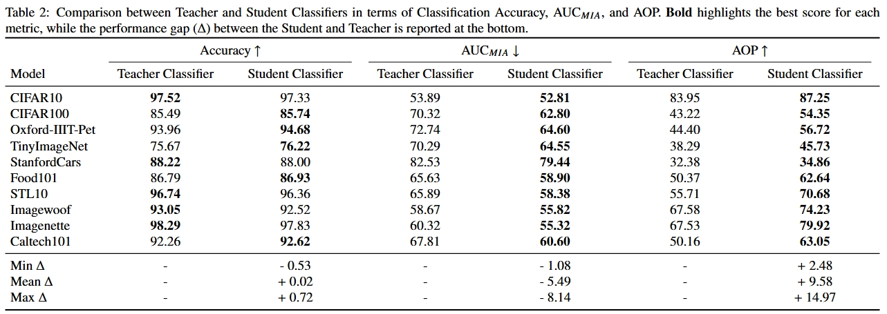

# TCKR

**Text-Conditioned Knowledge Recycling (TCKR):**  
A Synthetic Dataset Generation Pipeline for High-Performing and Privacy-Preserving Image Classifiers

ArXiv Preprint: [Your Image Generator Is Your New Private Dataset](https://arxiv.org/abs/2504.04582)


## Overview

This work introduces TCKR, a novel pipeline to generate synthetic datasets that achieve high utility for image classification while enhancing privacy protection. Addressing challenges like data scarcity, privacy issues, and dataset biases, TCKR leverages text-conditioned diffusion models to produce informative synthetic data. The pipeline integrates several components:
- **Stable Diffusion 2.0 (SD2):** Employed as a high-quality generator.
- **Low-Rank Adaptation (LoRA):** For efficient Stable Diffusion fine-tuning.
- **Dynamic Captioning with BLIP-2:** To capture instance-specific visual attributes.
- **Generative Knowledge Distillation (GKD):** To improve the informativeness of synthetic samples.

Comprehensive experiments across 10 diverse datasets have shown that classifiers trained on synthetic data generated by TCKR (i.e., the *Students*) can achieve test accuracy on real data comparable to - and in some cases exceeding - that of those trained on real data (i.e., the *Teachers*). Moreover, these classifiers demonstrate a significant increase in resilience against Membership Inference Attacks, as measured by the Area Under the ROC Curve (AUC<sub>MIA</sub>), and substantial improvements in the Accuracy Over Privacy (AOP) metric.


## Results




## Repository Structure

- `src/`: Source code:
    - `blip2_captioning.ipynb`: Notebook to create the textual prompts for SD2 finetuning/generation by captioning the Real Dataset (on HuggingFace) with BLIP-2.
    - `run_lora.ipynb`: Notebook (which runs `lora.py`) to fine-tune the SD2 generator on the Real Dataset (on HuggingFace) using LoRA.
    - `dataset_utils.ipynb`: Notebook to compute mean and standard deviation of the Real Dataset images (these values must be added inside the pre-processing function *get_tranform()* in `evaluate.py`) and to save an HuggingFace dataset on disk.
    - `run_evaluate.ipynb`: Notebook (which runs `evaluate.py`) to evaluate the classification performance of the MobileNetV3 Teachers and Students classifiers.
    - `mia_lira.ipynb`: Notebook to conduct a Membership Inference Attack (MIA) on a trained MobileNetV3 classifier, using the Likelihood Ratio Attack (LiRA).
    - `plots.ipynb`: Notebook to plot the results.
- `lora_sd2/`: LoRA weights for the SD2 models fine-tuned on each Real Training Dataset.
- `prompts/`: Prompts used for LoRA SD2 fine-tuning (in `original_order/`) and for Synthetic Training Dataset generation (in `grouped_by_class/`).
- `trained_mbnv3/`: Weights of the MobileNetV3 Teachers (in `teachers/`) and Students (in `students/`) classifiers, trained on the Real Dataset and the generated Synthetic Dataset, respectively. The Synthetic Dataset has a cardinality of 20× times the corresponding Real Dataset, except for Caltech101, where 10× was used due to its higher Classification Accuracy compared to 20×.
- `images/`: Plots used in the README.
- `requirements.txt`: All Python dependencies needed for the project.


## Installation

1. **Clone the repository:**

   ```
   git clone <repository_url>
   cd TCKR
   ```

2. **Create and activate a new virtual environment:**

   ```
   python3 -m venv venv
   source venv/bin/activate # On Windows use: venv\Scripts\activate
   ```

3. **Install the required dependencies:**

   ```
    pip install -r requirements.txt
    ```


## Usage

0. **Find the chosen Real Dataset on HuggingFace (HF)**
    - **Note:** The HuggingFace dataset must have an image column (type: *image*) and a label column (type: *string* or *class label*), and the correct number of training samples in the *train* split.
    - HF names of the 12 datasets implemented in this work: 
        - **Cifar10:** `uoft-cs/cifar10`
        - **Cifar100:** `uoft-cs/cifar100`
        - **Oxford-IIIT-Pet:** `Isamu136/oxford_pets_with_l14_emb`
        - **Tiny ImageNet:** `zh-plus/tiny-imagenet`
        - **Stanford Cars:** `Multimodal-Fatima/StanfordCars_train`
        - **Food101:** `Multimodal-Fatima/Food101_train`
        - **STL10:** `tanganke/stl10`
        - **Imagenette:** `Multimodal-Fatima/Imagenette_train`
        - **Imagewoof:** `frgfm/imagewoof`
        - **Caltech101:** `dpdl-benchmark/caltech101`

1. **Compute the Mean and Standard Deviation** of the real training images and insert them in the code as explained above.

2. **Run [blip2_captioning.ipynb](src/blip2_captioning.ipynb)** to create the textual prompts for SD2 finetuning/generation by captioning the HF Real Dataset with BLIP-2.

2. **Run [run_lora.ipynb](src/run_lora.ipynb)** to fine-tune with LoRA the SD2 generator on the HF Real Dataset coupled with the newly produced prompts.

4. **Run [run_evaluate.ipynb](src/run_evaluate.ipynb)** to train the Teacher and then the Student (trained on the Synthetic Dataset generated by the fine-tuned SD2), and finally to evaluate their classification performance on the real test set.

5. **Run [mia_lira.ipynb](src/mia_lira.ipynb)** to conduct a Membership Inference Attack (MIA) on the Teacher and the Student, by using the Likelihood Ratio Attack (LiRA).


## Additional Notes

Due to file size constraints, only a subset of the models weights is included in this repository:

- **Student Classifiers:** Only the Student Classifiers corresponding to the best Synthetic Dataset's cardinality for Classification Accuracy is provided.
- **Shadow Models for MIA:** The weights for the Shadow Models used in the Membership Inference Attack with LiRA have been omitted.

If you need the full set of weights for either the Student Classifiers or the Shadow Models, please contact us and we will be happy to provide them on request.

